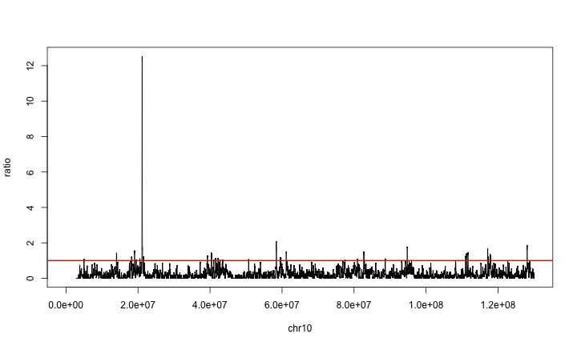

CIMPLR
========================================================

A package to call Common Insertion Sites using biasmaps without permutation testing.

In preparation for running the actual CIMPLR commands, we start by preparing an R environment containing CIMPLR functions and insertion data.

First set your working directory to the root folder of the package. Here we do that by setting the 'Knit' options to create this Vignette; use `setwd('../')` at the console.


```r
opts_knit$set(root.dir = "../")
```


Load the necessary libraries and sources of the package.


```r

library(Biobase)
```

```
## Loading required package: BiocGenerics
## Loading required package: parallel
## 
## Attaching package: 'BiocGenerics'
## 
## The following objects are masked from 'package:parallel':
## 
##     clusterApply, clusterApplyLB, clusterCall, clusterEvalQ,
##     clusterExport, clusterMap, parApply, parCapply, parLapply,
##     parLapplyLB, parRapply, parSapply, parSapplyLB
## 
## The following object is masked from 'package:stats':
## 
##     xtabs
## 
## The following objects are masked from 'package:base':
## 
##     Filter, Find, Map, Position, Reduce, anyDuplicated,
##     as.data.frame, cbind, colnames, duplicated, eval, get,
##     intersect, lapply, mapply, match, mget, order, paste, pmax,
##     pmax.int, pmin, pmin.int, rank, rbind, rep.int, rownames,
##     sapply, setdiff, sort, table, tapply, union, unique, unlist
## 
## Welcome to Bioconductor
## 
##     Vignettes contain introductory material; view with
##     'browseVignettes()'. To cite Bioconductor, see
##     'citation("Biobase")', and for packages 'citation("pkgname")'.
```

```r
library(GenomicFeatures)
```

```
## Loading required package: IRanges
## Loading required package: GenomicRanges
## Loading required package: AnnotationDbi
```

```r
library(rjson)
library(multicore)
```

```
## 
## Attaching package: 'multicore'
## 
## The following objects are masked from 'package:parallel':
## 
##     mclapply, mcparallel, pvec
```

```r
library(rtracklayer)
library(raster)
```

```
## Loading required package: sp
## 
## Attaching package: 'sp'
## 
## The following object is masked from 'package:IRanges':
## 
##     %over%
## 
## 
## Attaching package: 'raster'
## 
## The following object is masked from 'package:rtracklayer':
## 
##     values
## 
## The following objects are masked from 'package:AnnotationDbi':
## 
##     direction, select
## 
## The following objects are masked from 'package:GenomicRanges':
## 
##     distance, shift, values, values<-
## 
## The following objects are masked from 'package:IRanges':
## 
##     distance, shift, trim, values, values<-
```

```r

source("R/AllClasses.R")
source("R/AllGenerics.R")
```

```
## Creating a new generic function for 'metadata' in the global environment
```

```r
source("R/KSEDistribution.R")
source("R/core.R")
source("R/cimplr.R")
source("R/cimplr-calc.R")
source("R/cimplr-export.R")
source("R/biasmaps.R")
```


Load your data as a `data.frame` containing at least a `chr` and `location` column.


```r
# load('data/test_iset.rda')
iset <- read.table(file = "./data//WONG_NATURE-GENETICS_2014_INSERTIONS_MM10_FILTERED_BY_CONTROLS.cimpl", 
    sep = "\t", header = TRUE)

head(iset)
```

```
##    chr location screenID tissueID enzyme     barcode  tumorID contig_depth
## 1 chr7  3210455        2 40_7270S NlaIII BC454-SB076 40_7270S            3
## 2 chr7 19038846        2 40_7270S   BfaI BC454-SB076 40_7270S            1
## 3 chr7 19226038        2 40_7270S NlaIII BC454-SB076 40_7270S           20
## 4 chr7 46909017        2 40_7270S   BfaI BC454-SB076 40_7270S            1
## 5 chr7 67614618        2 40_7270S   BfaI BC454-SB076 40_7270S            3
## 6 chr7 92625253        2 40_7270S   BfaI BC454-SB076 40_7270S            4
```


Now we can start with CIMPLR.


Step 1: Initialise a CIMPLR object
-------------------------

We construct a CIMPLR object based on the insertion data and the parameters for the CIMPLR run.


```r
co <- cimplr(insertions = iset, exclude.chromosomes = c("chrY"), biasmap = "biasmaps/bsgenomes-mm9-TA-stepsize1000-D4", 
    biasmap.type = "count", scales = log.seq(500, 5e+05, 50)[seq(21, 40, 5)], 
    alpha = 0.05, p.adjust.method = "fdr", n.cores = 4, cis.annotation.file = "data/ensembl_genes.bed")
```

```
## *** CIMPLR *** 
## 
## List of 17
##  $ D                  : num 4
##  $ n.bp.total         : num 2.44e+09
##  $ n.bgsites.total    : num 1.5e+08
##  $ n.insertions.total : num 32769
##  $ chr.info           :'data.frame':	19 obs. of  3 variables:
##   ..$ length      : int [1:19] 152524553 125194864 131738871 61342430 149517037 121843856 95272651 98319150 90772031 159599783 ...
##   ..$ TA.count    : int [1:19] 8472607 7918256 7736225 3535808 9419851 6877351 5610869 6283983 5627839 10486365 ...
##   ..$ n.insertions: int [1:19] 1678 1514 1646 1048 1987 2214 1278 1399 1153 2207 ...
##  $ insertions.org     :'data.frame':	32776 obs. of  8 variables:
##   ..$ chr         : Factor w/ 20 levels "chr10","chr11",..: 16 16 16 16 16 16 16 16 16 16 ...
##   ..$ location    : int [1:32776] 3210455 19038846 19226038 46909017 67614618 92625253 92952702 97056541 98395176 99393210 ...
##   ..$ screenID    : int [1:32776] 2 2 2 2 2 2 2 2 2 2 ...
##   ..$ tissueID    : Factor w/ 70 levels "10_7613","11_7691",..: 13 13 13 13 13 13 13 13 13 13 ...
##   ..$ enzyme      : Factor w/ 2 levels "BfaI","NlaIII": 2 1 2 1 1 1 1 2 1 1 ...
##   ..$ barcode     : Factor w/ 70 levels "BC454-SB033",..: 14 14 14 14 14 14 14 14 14 14 ...
##   ..$ tumorID     : Factor w/ 70 levels "10_7613","11_7691",..: 13 13 13 13 13 13 13 13 13 13 ...
##   ..$ contig_depth: int [1:32776] 3 1 20 1 3 4 8 1 3 1 ...
##  $ chromosomes        : chr [1:19] "chr7" "chr14" "chr8" "chr19" ...
##  $ insertions         :List of 19
##   ..$ chr7 : int [1:1678] 3210455 19038846 19226038 46909017 67614618 92625253 92952702 97056541 98395176 99393210 ...
##   ..$ chr14: int [1:1514] 17893958 26512880 40878567 52139416 57530225 69708049 71892130 73161178 75227308 96892193 ...
##   ..$ chr8 : int [1:1646] 3152059 23196598 34626634 47052064 60978222 68089031 68593692 77289065 79284191 80250707 ...
##   ..$ chr19: int [1:1048] 7326254 20904182 22654029 29857844 31525437 37246395 40652290 44006361 44197154 45443250 ...
##   ..$ chr6 : int [1:1987] 3447880 6405852 26600402 48720280 50925101 52764959 65225553 71774293 83529828 86430918 ...
##   ..$ chr11: int [1:2214] 3263490 17769009 21399675 34521349 35839284 37082214 43279162 45896085 49202517 53354690 ...
##   ..$ chr17: int [1:1278] 5090488 8253812 34386089 41427468 42896538 51971057 71129315 74511283 87027271 87575420 ...
##   ..$ chr16: int [1:1399] 6163118 6714505 17337089 21460094 23332258 33189738 37747433 44237550 50591380 51649427 ...
##   ..$ chr18: int [1:1153] 9980760 16222612 31597498 38298397 42974124 44549427 55096663 59209073 64634149 68213506 ...
##   ..$ chr3 : int [1:2207] 9505282 15779662 21820449 30083642 32740364 40496480 55454422 56240909 58459711 60311415 ...
##   ..$ chr12: int [1:1539] 11101502 15897418 28741470 44671838 45036485 50497430 54858102 55810895 71033070 73880885 ...
##   ..$ chr15: int [1:1487] 16887549 17990994 19965804 23922725 30473804 37390785 37524690 38311159 42674719 48572304 ...
##   ..$ chrX : int [1:1073] 42286129 52482356 88360765 95473936 106036194 133695100 159869939 159915679 162368795 162475473 ...
##   ..$ chr4 : int [1:2209] 6636893 10820162 32283089 32953602 44862382 55262955 58352264 59594643 80919069 94017512 ...
##   ..$ chr2 : int [1:2817] 4078072 4776592 11320019 17349391 18312835 20840993 28091054 33854298 38802592 61562161 ...
##   ..$ chr9 : int [1:1979] 13510707 22657984 35172181 40408115 44622615 47168879 55537814 57900354 59886421 86008713 ...
##   ..$ chr13: int [1:1601] 6600526 9468757 13875505 24729575 32189293 36256884 69594329 72447712 72761972 94059653 ...
##   ..$ chr10: int [1:1903] 7802945 18168463 19505928 19610046 43532550 45318389 50984559 55529297 59569337 62260486 ...
##   ..$ chr5 : int [1:2037] 16973878 20947013 34246381 45432283 50484028 61463272 76261380 82136444 86305757 90301147 ...
##  $ exclude.chromosomes: chr "chrY"
##  $ scales             : num [1:4] 8384 16966 34332 69475
##  $ biasmap            : chr "biasmaps/bsgenomes-mm9-TA-stepsize1000-D4"
##  $ biasmap.type       : chr "count"
##  $ alpha              : num 0.05
##  $ p.adjust.method    : chr "fdr"
##  $ kNormal            : num 30
##  $ cis.annotation.file: chr "data/ensembl_genes.bed"
##  $ n.cores            : num 4
```


Step 2: Load a bias map
-------------------------

As a bias map, we load the TA count files under the './biasmaps' folder. This bias map is simply the TA site background, but more sophisticated bias maps can be supplied here (link to CreateBiasMap Vignette).


```r
co <- cimplr.biasmap(co)
```

```
## cimplr.biasmap() - load biasmaps
## cimplr.biasmap() - load KSE distributions
```


```r
plot.chrscale(co, "chr10", 34332, "bg")
```

 


Step 3: Gaussian Kernel Convolution
-------------------------

With the insertion data and the bias map loaded and pre-processed within the CIMPLR object, we can now start the kernel convolution, resulting in Kernel Smoothed Estimates (KSEs) for all scales.

```r
co <- cimplr.convolve(co)
```

```
## cimplr.convolve()
```


```r
plot.chrscale(co, "chr10", 34332, "kse")
```

 


```r
plot.chrscale(co, "chr10", 34332, "p")
```

 


Step 4: Calculate the threshold and the kse/ratio's
-------------------------

A seperate step calculates the threshold for the KSE at each scale. This is done using the analytical KSE distribution at a controlled FDR and taking into account multiple scales (link to KSEdistribution Vignette).

```r
co <- cimplr.ratios(co)
```

```
## cimplr.ratios() - calculate corrected alpha
## calc.corrected.alpha() - p.adjust.method = fdr
## cimplr.ratios() - calculate ratios
```


```r
plot.chrscale(co, "chr10", 34332, "ratio")
```

 


Step 5: Call CISes
-------------------------

With the thresholds in place, the last step is to do the CIS calling. This returns two lists of CISes: (1) all CIS for each scale, and (2) the cross scale CIS using the 'cis-cloud-global-maximum' procedure (link to CrossScaleCIScalling Vignette)


```r
co <- cimplr.call(co)
```

```
## cimplr.call() - call CIS
## cimplr.call() - call cross-scale CIS
```


Step 6: Output figures and cis list. The export function generates:
- all_cises.csv
- collapsed_cises.csv (according to the 'cis-cloud-global-maximum' procedure)
- a scale space figure per chromosome, focussing on the collapsed CIS regions
- figures and CIS lists per scale (include.scales=TRUE)


```r
export.cis(co, what = "all", type = "txt", file = "all_cises.txt")
export.cis(co, what = "collapsed", type = "txt", file = "collapsed_cises.txt")

export.cis(co, what = "all", type = "bed", file = "all_cises.bed")
export.cis(co, what = "collapsed", type = "bed", file = "collapsed_cises.bed")
```


